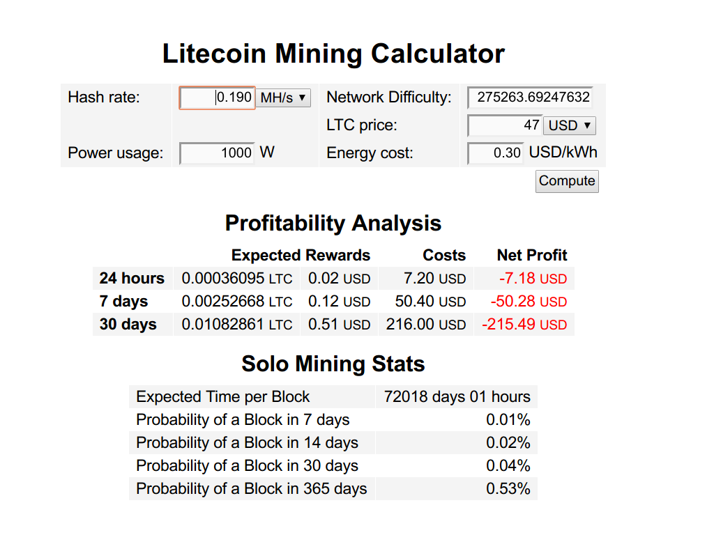

# Getting Namecoin

There is several interesting blockchain applications like Namecoin that needs as start fund.
One of the options is to mine some Litecoins using AWS spot GPU and exchange them to Namecoins.
It is not profitable, thou enough to be a start found for Namecoin domain registration.

Or we just can mine Namecoin directly.

## Mining Litecoin

### Register to mining pool

* https://www.wemineltc.com/
* http://give-me-coins.com/

Set up a mining worker in your pool, and take note of the URL, worker name and worker password.
Choose a port 80 URL if possible (e.g. ltc.give-me-coins.com:80) , later we will
need to configure any firewall rules or AWS Security Groups.

###  Set Up `g2.2xlarge` Spot Instance on Amazon EC2

GPU instances require AMIs based on hardware-assisted virtualization (HVM), so
make sure that you select a HVM AMI. The code below is for the Ubuntu Server
12.04.3 LTS for HVM Instances (64 bit) AMI, but you can choose another HVM AMI
if you know how to set it up.

Create spot `g2.2xlarge` instance with following settings:

Number of instances: 1
Purchasing option: check Request Spot Instances
Maximum price: the maximum price you are willing to pay for the instance. A good
rule of thumb is to use the current price shown on the screen, or slightly more.
At the time of writing, g2.2xlarge Spot Instances were going for about $0.30.

Once you have configured the instance, click Launch. A dialog box will appear,
asking you to select or create a key pair. If you have already created an Amazon
EC2 key pair, you can select it from the dropdown list. Otherwise, select Create
a new key pair, enter a name for it (for example, “LTC”) and click Download Key
Pair. You will get a file like LTC.pem, which contains the private key you will
need to log in to your new server.

Wait a few minutes, and if your Spot Request was fulfilled successfully, you
should see a new running instance in the Instances section of the EC2 Management
Console.

#### Spot request json config example :

```
{

        "IamFleetRole": "arn:aws:iam::333044380752:role/aws-ec2-spot-fleet-role",

        "AllocationStrategy": "lowestPrice",

        "TargetCapacity": 1,

        "SpotPrice": "0.35",

        "ValidFrom": "2017-07-12T14:37:08Z",

        "ValidUntil": "2018-07-12T14:37:08Z",

        "TerminateInstancesWithExpiration": true,

        "LaunchSpecifications": [

        {

                "ImageId": "ami-09447c6f",

                "InstanceType": "g2.2xlarge",

                "SubnetId": "subnet-d808299e",

                "KeyName": "30c4326f21fd0e106fe2a5885eba7ba4",

                "BlockDeviceMappings": [

                {

                        "DeviceName": "/dev/sda1",

                        "Ebs": {

                                "DeleteOnTermination": true,

                                "VolumeType": "gp2",

                                "VolumeSize": 8,

                                "SnapshotId": "snap-086b1e94a89919b4d"

                        }

                }

                ],

                        "SecurityGroups": [

                        {

                                "GroupId": "sg-b875abc0"

                        }

                ]

        }

        ],

                "Type": "request"

}
```

### Setup mining on spot instance

```
chmod 400 LTC.pem
ssh -i LTC.pem ubuntu@INSTANCE_PUBLIC_URL
```

### Lets try cuda 7.

```
wget http://developer.download.nvidia.com/compute/cuda/repos/ubuntu1404/x86_64/cuda-repo-ubuntu1404_7.5-18_amd64.deb
sudo dpkg -i cuda-repo-ubuntu1404_7.5-18_amd64.deb
$ sudo apt-get update
$ sudo apt-get upgrade -y
$ sudo apt-get install -y opencl-headers build-essential protobuf-compiler \
    libprotoc-dev libboost-all-dev libleveldb-dev hdf5-tools libhdf5-serial-dev \
    libopencv-core-dev  libopencv-highgui-dev libsnappy-dev libsnappy1 \
    libatlas-base-dev cmake libstdc++6-4.8-dbg libgoogle-glog0 libgoogle-glog-dev \
    libgflags-dev liblmdb-dev git python-pip gfortran
$ sudo apt-get clean

```

#### DRM module workaround

```
$ sudo apt-get install -y linux-image-extra-`uname -r` linux-headers-`uname -r` linux-image-`uname -r`
```

For an explanation of why this is needed, see [Caffe on EC2 Ubuntu 14.04 Cuda 7](https://github.com/BVLC/caffe/wiki/Caffe-on-EC2-Ubuntu-14.04-Cuda-7)
and search for this command.

#### Install and veryfy CUDA

```
$ sudo apt-get install -y cuda
$ sudo apt-get clean
```

Lets verify:

```
nvidia-smi
Wed Jul 12 15:16:44 2017
+-----------------------------------------------------------------------------+
| NVIDIA-SMI 375.66                 Driver Version: 375.66                    |
|-------------------------------+----------------------+----------------------+
| GPU  Name        Persistence-M| Bus-Id        Disp.A | Volatile Uncorr. ECC |
| Fan  Temp  Perf  Pwr:Usage/Cap|         Memory-Usage | GPU-Util  Compute M. |
|===============================+======================+======================|
|   0  GRID K520           Off  | 0000:00:03.0     Off |                  N/A |
| N/A   24C    P0    47W / 125W |      0MiB /  4036MiB |      0%      Default |
+-------------------------------+----------------------+----------------------+

+-----------------------------------------------------------------------------+
| Processes:                                                       GPU Memory |
|  GPU       PID  Type  Process name                               Usage      |
|=============================================================================|
|  No running processes found                                                 |
+-----------------------------------------------------------------------------+
```

Make sure kernel module and devices are present:

```
lsmod | grep -i nvidia
nvidia_uvm            631523  0
nvidia_drm             14658  0
drm                   303102  1 nvidia_drm
nvidia_modeset        790005  1 nvidia_drm
nvidia              12307502  2 nvidia_modeset,nvidia_uvm
```

#### Add exports to `~/.bashrc`

```
vi ~/.bashrc
```

```
export PATH=/usr/local/cuda/bin:$PATH
export LD_LIBRARY_PATH=/usr/local/cuda/lib64:$LD_LIBRARY_PATH
```

```
source ~/.bashrc
```

#### Install [ CudaMiner ](https://github.com/cbuchner1/CudaMiner)

```
git clone https://github.com/cbuchner1/CudaMiner && cd CudaMiner
./configure.sh
make
```

Got error:

```
nvcc fatal   : Value 'compute_10' is not defined for option 'gpu-architecture'
make[2]: *** [salsa_kernel.o] Error 1
make[2]: Leaving directory `/home/ubuntu/CudaMiner'
make[1]: *** [all-recursive] Error 1
make[1]: Leaving directory `/home/ubuntu/CudaMiner'
make: *** [all] Error 2
```

Check `nvcc --help` for `--gpu-architecture`, you should see a list of supported architectures.

```
Allowed values for this option:  'compute_20','compute_30','compute_32',
        'compute_35','compute_37','compute_50','compute_52','compute_53','compute_60',
        'compute_61','compute_62','sm_20','sm_21','sm_30','sm_32','sm_35','sm_37',
        'sm_50','sm_52','sm_53','sm_60','sm_61','sm_62'.

```

In Makefile replace `compute_10` with `compute_62` using following VIM command:

`:%s/compute_10/compute_62/gi`

Try to run :
```
make clean
make
/usr/bin/ld: cudaminer-cpu-miner.o: undefined reference to symbol 'SHA256@@OPENSSL_1.0.0'
//lib/x86_64-linux-gnu/libcrypto.so.1.0.0: error adding symbols: DSO missing from command line
collect2: error: ld returned 1 exit status

sudo apt-get install automake
./autogen.sh
./configure
```
Again ,In Makefile replace `compute_10` with `compute_62` using following VIM command:

`:%s/compute_10/compute_62/gi`

After some time :

```
g++  -g -O2 -pthread -L/usr/local/cuda/lib64  -o cudaminer cudaminer-cpu-miner.o cudaminer-util.o wrapnvml.o cudaminer-sha2.o cudaminer-scrypt.o cudaminer-maxcoin.o cudaminer-blakecoin.o cudaminer-sha3.o cudaminer-scrypt-jane.o salsa_kernel.o sha256.o keccak.o blake.o cudaminer-blake.o fermi_kernel.o kepler_kernel.o test_kernel.o nv_kernel.o nv_kernel2.o titan_kernel.o -L/usr/lib/x86_64-linux-gnu -lcurl compat/jansson/libjansson.a -lpthread  -lcudart -fopenmp -lcrypto -lssl  -ldl -lcrypto -lssl
make[2]: Leaving directory `/home/ubuntu/CudaMiner'
make[1]: Leaving directory `/home/ubuntu/CudaMiner'
```

Success!

#### Start mining

We need url to start mining , our worker name and pass , For example :

[give-me-coins scrypt guide](http://give-me-coins.com/support/scrypt-guide/)

Our spot instance is in EU region , so one of following should be used :

##### EU Servers - share difficulty of 16 - 4096

* ltc-eu.give-me-coins.com:3333
* ltc-eu.give-me-coins.com:3334

The `-H 1` tells cudaminer to distribute SHA256 hashing evenly to all CPU cores,
and `-C 1` turns on the texture cache for mining, which should improve performance
on Kepler GPUs.

Added port 3334 to instances in bound allowed firewall rules , in Security
Group.

```
./cudaminer --url=stratum+tcp://ltc-eu.give-me-coins.com:3334 --userpass=WORKER_NAME:WORKER_PASSWORD -H 1 -C 1
   *** CudaMiner for nVidia GPUs by Christian Buchner ***
             This is version 201814-02-28 (beta)
based on pooler-cpuminer 2.3.2 (c) 2010 Jeff Garzik, 2010012 pooler
    Cuda additions Copyright 2013,2014 Christian Buchner
                 LTC donation address: LKS1WDKGED647msBQfLBHV3Ls8sveGncnm
  BTC donationon address: 16hJF5mceSojnTD3ZTUDqdRhDyPJzoRakM
  YAC donation address:address Y87sptDEcpLkLeAuex6qZioDbvy1qXZEj4
[2017-07-12 16:33:12] NVML GPU monitoring is not available.
[2017-07-12 16:33:12] Starting Stratum on
stratum+tcp://ltc-eu.give-me-coins.com:3334
[2017-07-12 16:33:12] 1 miner threads started, using 'scrypt' algorithm.
[2017-07-12 16:33:12] GPU #0: GRID K520 with compute capability 3.0
[2017-07-12 16:33:12] GPU #0: interactive: 0, tex-cache: 1D, single-alloc: 1
[2017-07-12 16:33:12] GPU #0: 32 hashes / 4.0 MB per warp.
[2017-07-12 16:33:12] GPU #0: Performing auto-tuning (Patience...)
[2017-07-12 16:33:12] GPU #0: maximum total warps (BxW): 512

```

#### Monitoring CUDA performance

```
watch -n 1 nvidia-smi
Thu Jul 13 21:31:46 2017
+-----------------------------------------------------------------------------+
| NVIDIA-SMI 375.66                 Driver Version: 375.66                    |
|-------------------------------+----------------------+----------------------+
| GPU  Name        Persistence-M| Bus-Id        Disp.A | Volatile Uncorr. ECC |
| Fan  Temp  Perf  Pwr:Usage/Cap|         Memory-Usage | GPU-Util  Compute M. |
|===============================+======================+======================|
|   0  GRID K520           Off  | 0000:00:03.0     Off |                  N/A |
| N/A   57C    P0    96W / 125W |   2097MiB /  4036MiB |    100%      Default |
+-------------------------------+----------------------+----------------------+

+-----------------------------------------------------------------------------+
| Processes:                                                       GPU Memory |
|  GPU       PID  Type  Process name                               Usage      |
|=============================================================================|
|    0     13506    C   ./cudaminer                                   2095MiB |
+-----------------------------------------------------------------------------+
```

#### Result

???
After some time got following output :

```
[2017-07-12 16:35:51] GPU #0: 164033.56 hash/s with configuration K8x32
[2017-07-12 16:35:51] GPU #0: using launch configuration K8x32
[2017-07-12 16:35:53] GPU #0: GRID K520, 167.22 khash/s
[2017-07-12 16:36:17] GPU #0: GRID K520, 163.51 khash/s
[2017-07-12 16:36:18] accepted: 1/1 (100.00%), 163.51 khash/s (yay!!!)

[2017-07-12 16:37:13] GPU #0: GRID K520, 163.53 khash/s
[2017-07-12 16:37:13] accepted: 2/2 (100.00%), 163.53 khash/s (yay!!!)
[2017-07-12 16:37:41] GPU #0: GRID K520, 163.53 khash/s
[2017-07-12 16:37:41] accepted: 3/3 (100.00%), 163.53 khash/s (yay!!!)
[2017-07-12 16:38:02] GPU #0: GRID K520, 163.53 khash/s
[2017-07-12 16:38:02] accepted: 4/4 (100.00%), 163.53 khash/s (yay!!!)

```

And so on, so now we need a way to keep it mining in background.

Create a `startMining.sh` script and give it exexution permissions `chmod +x startMining.sh`.

```
#!/bin/bash

WORKER_NAME="yourworker.XXXXXXXXXXXX"
WORKER_PASSWORD="XXXXXXXXXXXX"

nohup ./cudaminer --url=stratum+tcp://ltc-eu.give-me-coins.com:3334 --userpass=$WORKER_NAME:$WORKER_PASSWORD -H 1 -C 1 &
```

Execute it `./startMining.sh`, and now you can review the process using `tail -f nohup.out`.

#### Profit



#### Reference
* Posted by Aloysius Lim , Dec 2nd, 2013 [ Is Mining Litecoins on AWS EC2 Profitable? PART 2: GPU Mining ](https://aloysius.wordpress.com/2013/12/02/is-mining-litecoins-on-aws-ec2-profitable-part-2-gpu-mining/)
* Posted by Traun Leyden Nov 22nd, 2015 [ CUDA 7.5 on AWS GPU Instance Running Ubuntu 14.04 ](http://tleyden.github.io/blog/2015/11/22/cuda-7-dot-5-on-aws-gpu-instance-running-ubuntu-14-dot-04/)
* [ Caffe on EC2 Ubuntu 14.04 Cuda 7 ](https://github.com/BVLC/caffe/wiki/Caffe-on-EC2-Ubuntu-14.04-Cuda-7)
* [ CudaMiner ](https://github.com/cbuchner1/CudaMiner)
* [Litecoin Mining Calculator](https://www.litecoinpool.org/calc)


